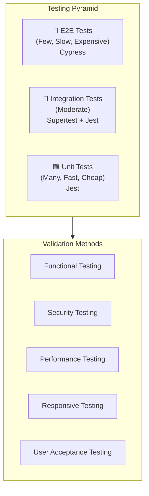
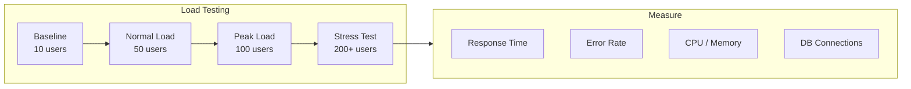
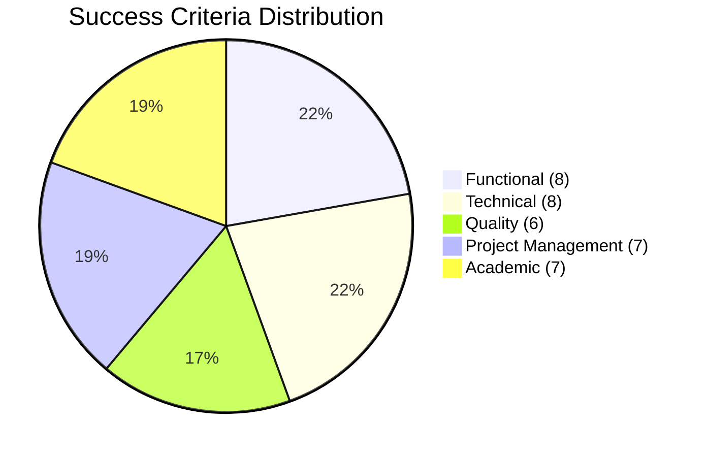

# ProfAI — Validation, Testing Plan & Success Criteria

<div align="center">

**Professor Exam Style Analysis Platform**

Version 1.0 | March 2026

Prepared by: Erdem Acar, Enes Albas, Ali Emir Erten

UYG338 — Software Project Management

</div>

---

## Table of Contents

1. [Validation and Testing Plan](#1-validation-and-testing-plan)
   - 1.1 [Testing Strategy Overview](#11-testing-strategy-overview)
   - 1.2 [Testing Levels](#12-testing-levels)
   - 1.3 [Test Cases](#13-test-cases)
   - 1.4 [Validation Methods](#14-validation-methods)
   - 1.5 [Performance Evaluation](#15-performance-evaluation)
   - 1.6 [Testing Tools and Environment](#16-testing-tools-and-environment)
   - 1.7 [Test Schedule](#17-test-schedule)
2. [Success Criteria](#2-success-criteria)

---

## 1. Validation and Testing Plan

### 1.1 Testing Strategy Overview



#### Testing Approach

| Aspect | Approach |
|--------|----------|
| **Methodology** | Agile testing — tests written alongside features per sprint |
| **Philosophy** | Test pyramid: more unit tests, fewer E2E tests |
| **Automation** | All unit and integration tests automated |
| **Manual** | UI/UX testing, exploratory testing, cross-browser testing |
| **Frequency** | Unit/integration tests run on every commit, E2E before each sprint release |

---

### 1.2 Testing Levels

#### 1.2.1 Unit Testing

Unit tests verify individual functions and components in isolation.

**Backend Unit Tests:**

| Module | What is Tested | Example |
|--------|---------------|---------|
| Auth Service | Password hashing, JWT generation/verification | `hashPassword("test123")` returns valid bcrypt hash |
| Analysis Service | Question type calculation, difficulty scoring | `calculateDifficulty(examData)` returns score 1-10 |
| Validation | Input validation functions | `validateEmail("invalid")` returns false |
| Controllers | Request handling logic (mocked dependencies) | `registerController` returns 400 on missing email |

**Frontend Unit Tests:**

| Component | What is Tested | Example |
|-----------|---------------|---------|
| SearchBar | Renders correctly, handles input changes | Input updates state on change |
| ProfessorCard | Displays correct data, handles click | Shows professor name and department |
| RatingForm | Form validation, star selection | Submit disabled when no score selected |
| AnalysisCard | Renders charts with correct data | Pie chart shows correct percentages |

#### 1.2.2 Integration Testing

Integration tests verify that different modules work together correctly.

**API Integration Tests:**

| Test Suite | What is Tested | Method |
|-----------|---------------|--------|
| Auth Flow | Register → Login → Access protected route | Supertest + Jest |
| Professor CRUD | Create → Read → Update flow | Supertest + Jest |
| Exam Upload | Upload file → Verify DB record → Retrieve | Supertest + Jest |
| Rating Flow | Create rating → Get professor average | Supertest + Jest |
| Analysis | Upload exam → Trigger analysis → Get results | Supertest + Jest |

**Database Integration Tests:**

| Test | What is Tested |
|------|---------------|
| Migration | All Prisma migrations run successfully |
| Relationships | Foreign keys and cascading deletes work correctly |
| Constraints | Unique email constraint, required fields |
| Seeding | Test data seeded correctly |

#### 1.2.3 End-to-End (E2E) Testing

E2E tests simulate real user workflows through the entire application.

| Test Scenario | Steps | Expected Outcome |
|--------------|-------|-----------------|
| **Student Registration** | 1. Navigate to /register → 2. Fill form → 3. Submit → 4. Redirect to /login | Account created, redirect successful |
| **Login & Browse** | 1. Login → 2. Search professor → 3. View details → 4. See analysis | All pages load, data displays correctly |
| **Exam Upload** | 1. Login → 2. Go to /upload → 3. Select course → 4. Upload file → 5. Check dashboard | File uploaded, appears in dashboard |
| **Rate Professor** | 1. Login → 2. View professor → 3. Submit rating → 4. Check updated average | Rating saved, average recalculated |
| **Guest Browsing** | 1. Visit home → 2. Search → 3. View professor → 4. See analysis | All public data accessible without login |

#### 1.2.4 Security Testing

| Test | Method | What is Tested |
|------|--------|---------------|
| SQL Injection | Manual + automated payloads | API inputs with malicious SQL strings |
| XSS Attack | Inject script tags in forms | Comment fields, professor names |
| JWT Manipulation | Tamper with token payload | Modified tokens rejected |
| Brute Force | Rapid login attempts | Rate limiter blocks after threshold |
| File Upload | Upload .exe, .sh, oversized files | Only PDF/JPG/PNG accepted, size limited |
| CORS | Cross-origin requests from unauthorized domains | Requests blocked |
| Authorization | Access protected routes without token | 401 returned |
| Privilege Escalation | Student tries admin actions | 403 returned |

#### 1.2.5 Responsive / UI Testing

| Device | Resolution | Browser | Test Method |
|--------|-----------|---------|-------------|
| Desktop | 1920×1080 | Chrome, Firefox, Edge | Manual + screenshot |
| Laptop | 1366×768 | Chrome | Manual |
| Tablet | 768×1024 | Safari, Chrome | Chrome DevTools |
| Mobile | 375×812 | Chrome Mobile, Safari iOS | Chrome DevTools |
| Small Mobile | 320×568 | Chrome | Chrome DevTools |

---

### 1.3 Test Cases

#### 1.3.1 Authentication Test Cases

| TC ID | Test Case | Precondition | Input | Expected Result | Priority |
|-------|-----------|-------------|-------|----------------|----------|
| TC-A01 | Register with valid data | None | Valid name, email, password | 201 Created, user in DB | High |
| TC-A02 | Register with existing email | Email exists in DB | Duplicate email | 409 Conflict | High |
| TC-A03 | Register with invalid email | None | "notanemail" | 400 Bad Request | Medium |
| TC-A04 | Register with short password | None | Password "123" | 400 Bad Request | Medium |
| TC-A05 | Login with correct credentials | User registered | Valid email + password | 200 OK, JWT token returned | High |
| TC-A06 | Login with wrong password | User registered | Valid email + wrong password | 401 Unauthorized | High |
| TC-A07 | Login with non-existent email | None | Unregistered email | 401 Unauthorized | High |
| TC-A08 | Access protected route with valid token | User logged in | Valid JWT | 200 OK | High |
| TC-A09 | Access protected route without token | None | No Authorization header | 401 Unauthorized | High |
| TC-A10 | Access protected route with expired token | Token expired | Expired JWT | 401 Unauthorized | Medium |

#### 1.3.2 Professor Management Test Cases

| TC ID | Test Case | Input | Expected Result | Priority |
|-------|-----------|-------|----------------|----------|
| TC-P01 | List all professors | GET /api/professors | 200 OK, array of professors | High |
| TC-P02 | Get professor by ID | GET /api/professors/1 | 200 OK, professor object | High |
| TC-P03 | Get non-existent professor | GET /api/professors/9999 | 404 Not Found | Medium |
| TC-P04 | Create professor (authenticated) | POST with valid data + JWT | 201 Created | High |
| TC-P05 | Create professor (unauthenticated) | POST without JWT | 401 Unauthorized | High |
| TC-P06 | Search professors by name | GET /api/professors?search=Smith | Filtered results | Medium |
| TC-P07 | Filter by department | GET /api/professors?dept=CS | Filtered results | Medium |
| TC-P08 | Get professor analysis | GET /api/professors/1/analysis | Analysis summary data | High |

#### 1.3.3 Exam Upload Test Cases

| TC ID | Test Case | Input | Expected Result | Priority |
|-------|-----------|-------|----------------|----------|
| TC-E01 | Upload valid PDF | PDF file, < 10MB | 201 Created, file stored | High |
| TC-E02 | Upload valid JPG | JPG file, < 10MB | 201 Created, file stored | High |
| TC-E03 | Upload invalid file type | .exe file | 400 Bad Request | High |
| TC-E04 | Upload oversized file | 15MB PDF | 400 File too large | High |
| TC-E05 | Upload without authentication | File + no JWT | 401 Unauthorized | High |
| TC-E06 | Upload without selecting course | File + no courseId | 400 Bad Request | Medium |
| TC-E07 | List exams for a course | GET /api/exams/course/1 | Array of exams | High |

#### 1.3.4 Rating Test Cases

| TC ID | Test Case | Input | Expected Result | Priority |
|-------|-----------|-------|----------------|----------|
| TC-R01 | Submit valid rating | difficulty: 4, fairness: 3, comment | 201 Created | High |
| TC-R02 | Submit rating without auth | Rating data + no JWT | 401 Unauthorized | High |
| TC-R03 | Submit rating with invalid score | difficulty: 6 | 400 Bad Request (max 5) | Medium |
| TC-R04 | Submit rating with score 0 | difficulty: 0 | 400 Bad Request (min 1) | Medium |
| TC-R05 | Get professor ratings | GET /api/ratings/professor/1 | Array of ratings + averages | High |

#### 1.3.5 Analysis Engine Test Cases

| TC ID | Test Case | Input | Expected Result | Priority |
|-------|-----------|-------|----------------|----------|
| TC-AN01 | Analysis generates after exam upload | Upload exam file | ExamAnalysis record created | High |
| TC-AN02 | Question type distribution calculated | Exam with mixed questions | Correct percentages (sum = 100%) | High |
| TC-AN03 | Difficulty score in valid range | Any exam | Score between 1-10 | High |
| TC-AN04 | Topic distribution generated | Exam with topics | Non-empty topic distribution | Medium |
| TC-AN05 | Summary text generated | Any exam | Non-empty summary string | Medium |

---

### 1.4 Validation Methods

#### 1.4.1 Functional Validation

| Method | Description | Applied To |
|--------|-------------|-----------|
| **Requirement Tracing** | Each feature mapped back to original requirements | All features |
| **Positive Testing** | Test with valid inputs expecting correct outputs | All endpoints |
| **Negative Testing** | Test with invalid inputs expecting proper error handling | All endpoints |
| **Boundary Testing** | Test at edge values (min/max lengths, 0, null) | Input fields, ratings |
| **Equivalence Partitioning** | Group inputs into valid/invalid classes | Registration, file upload |

#### 1.4.2 Data Validation

| Validation | Rule | Where Applied |
|-----------|------|--------------|
| Email format | RFC 5322 compliant | Registration, login |
| Password strength | Min 8 chars, mixed case + number | Registration |
| Rating range | 1 ≤ score ≤ 5 | Rating submission |
| File type | PDF, JPG, PNG only | Exam upload |
| File size | ≤ 10MB | Exam upload |
| Required fields | Not null, not empty | All forms |
| String length | Max length per field | All text inputs |
| Foreign keys | Referenced record must exist | Course-Professor, Exam-Course |

#### 1.4.3 User Acceptance Testing (UAT)

| UAT Scenario | Tester | Acceptance Criteria |
|-------------|--------|-------------------|
| Register and login successfully | Team member | Account created, redirected to home |
| Find a professor by searching | Team member | Results appear within 2 seconds |
| View professor's exam analysis | Team member | Charts render correctly with data |
| Upload an exam file | Team member | File uploaded, visible in dashboard |
| Rate a professor | Team member | Rating saved, average updated |
| Browse on mobile device | Team member | All pages usable, no layout breaks |
| Guest browses without login | Team member | Public pages accessible, upload blocked |

---

### 1.5 Performance Evaluation

#### 1.5.1 Performance Metrics

| Metric | Target | Measurement Tool | Threshold |
|--------|--------|-----------------|-----------|
| **Page Load Time** | < 3 seconds | Chrome Lighthouse | FCP < 2s, LCP < 3s |
| **API Response Time** | < 500ms average | Postman / custom logging | P95 < 1000ms |
| **File Upload Time** | < 10s for 10MB | Manual measurement | Max 15 seconds |
| **Database Query Time** | < 100ms | Prisma query logging | P95 < 200ms |
| **Concurrent Users** | 100+ simultaneous | Load testing (Artillery) | No errors at 100 users |
| **Memory Usage** | < 512MB per container | Docker stats | Alert at 80% |
| **Error Rate** | < 1% | Application logging | Alert at 2% |

#### 1.5.2 Performance Testing Plan



| Test Type | Users | Duration | Goal |
|-----------|-------|----------|------|
| **Baseline** | 10 | 5 minutes | Establish normal performance |
| **Load Test** | 50 | 10 minutes | Verify acceptable performance under expected load |
| **Peak Test** | 100 | 10 minutes | Verify system handles peak usage |
| **Stress Test** | 200+ | 15 minutes | Find breaking point and recovery behavior |
| **Endurance Test** | 50 | 1 hour | Check for memory leaks, connection pool exhaustion |

#### 1.5.3 Lighthouse Score Targets

| Category | Target Score | Description |
|----------|-------------|-------------|
| Performance | ≥ 80 | Fast loading, efficient rendering |
| Accessibility | ≥ 85 | WCAG 2.1 AA compliance |
| Best Practices | ≥ 90 | Modern web standards |
| SEO | ≥ 80 | Search engine friendly |

---

### 1.6 Testing Tools and Environment

#### 1.6.1 Testing Stack

| Tool | Purpose | Layer |
|------|---------|-------|
| **Jest** | Unit testing framework | Backend + Frontend |
| **Supertest** | HTTP integration testing | Backend API |
| **React Testing Library** | Component testing | Frontend |
| **Cypress** | E2E browser testing | Full Stack |
| **Postman** | Manual API testing | Backend API |
| **Chrome DevTools** | Performance + responsive testing | Frontend |
| **Lighthouse** | Performance auditing | Frontend |
| **Artillery** | Load / stress testing | Full Stack |
| **npm audit** | Dependency security scanning | Security |

#### 1.6.2 Test Environment

| Environment | Purpose | Database | URL |
|-------------|---------|----------|-----|
| **Development** | Local development and unit tests | Local PostgreSQL (Docker) | localhost:3000 / :5000 |
| **Testing** | Integration and E2E tests | Separate test database | localhost:3001 / :5001 |
| **Production** | Live deployment | Production database | TBD |

#### 1.6.3 Test Data Strategy

| Data Type | Strategy | Example |
|-----------|----------|---------|
| Users | Seed file with 5 test users | test@profai.com / Test1234 |
| Professors | Seed file with 10 professors | Across 3 departments |
| Courses | Seed file with 20 courses | Linked to professors |
| Exams | Seed file with 30 exam records | Mix of midterm/final/makeup |
| Ratings | Seed file with 50 ratings | Various scores |
| Analyses | Auto-generated from seeded exams | Statistical data |

---

### 1.7 Test Schedule

| Sprint | Testing Activities | Responsible |
|--------|-------------------|-------------|
| Sprint 0 (Week 1-2) | Set up testing framework (Jest, Supertest), write auth unit tests | ERDEM |
| Sprint 1 (Week 3-4) | API integration tests for all endpoints, analysis engine unit tests | ENES |
| Sprint 2 (Week 5-6) | Frontend component tests, responsive testing, cross-browser checks | ALL TEAM |
| Sprint 3 (Week 7-8) | E2E tests (Cypress), security testing, performance testing, UAT | ALL TEAM |

#### Test Completion Criteria

Before each sprint is marked as "Done":
- [ ] All unit tests pass
- [ ] All integration tests pass
- [ ] No critical or high-severity bugs open
- [ ] Code review completed for all PRs
- [ ] Responsive design verified on mobile/tablet/desktop

---

## 2. Success Criteria

### 2.1 Project Success Criteria Overview

The ProfAI project will be considered successful when it meets the following criteria across five dimensions: **Functional**, **Technical**, **Quality**, **Project Management**, and **Academic**.

### 2.2 Functional Success Criteria

| # | Criterion | Measurement | Target | Priority |
|---|-----------|-------------|--------|----------|
| F1 | User registration and login works | Automated test | 100% pass rate | Must Have |
| F2 | Professors can be listed and searched | Manual + automated test | Search returns results in < 2s | Must Have |
| F3 | Exam files can be uploaded | Upload test with PDF/JPG/PNG | Successful upload and storage | Must Have |
| F4 | Exam analysis is generated | Upload triggers analysis | Analysis record created with valid data | Must Have |
| F5 | Analysis card displays charts | Visual inspection | Pie chart + bar chart render correctly | Must Have |
| F6 | Professors can be rated | Automated test | Rating saved, average calculated | Must Have |
| F7 | Dashboard shows user data | Manual test | Uploads and stats displayed | Should Have |
| F8 | All pages are responsive | Multi-device test | Usable on 320px - 1920px screens | Should Have |

### 2.3 Technical Success Criteria

| # | Criterion | Measurement | Target |
|---|-----------|-------------|--------|
| T1 | API response time | Performance testing | Average < 500ms |
| T2 | Page load time | Lighthouse audit | FCP < 2 seconds |
| T3 | Docker setup works | `docker-compose up` | All 3 services start successfully |
| T4 | Database migrations run | `prisma migrate deploy` | No errors |
| T5 | No critical security vulnerabilities | Security testing + npm audit | 0 critical, 0 high vulnerabilities |
| T6 | JWT authentication functional | Auth flow testing | Token generation and validation works |
| T7 | File upload validation | Security testing | Invalid files rejected, valid files accepted |
| T8 | CORS properly configured | Cross-origin testing | Only allowed origins accepted |

### 2.4 Quality Success Criteria

| # | Criterion | Measurement | Target |
|---|-----------|-------------|--------|
| Q1 | Unit test pass rate | Jest test runner | ≥ 95% |
| Q2 | Integration test pass rate | Supertest results | ≥ 90% |
| Q3 | No critical bugs at delivery | Bug tracker (Jira) | 0 critical, 0 high-severity bugs |
| Q4 | Code follows TypeScript strict mode | TSC compiler | 0 type errors |
| Q5 | Lighthouse performance score | Chrome Lighthouse | ≥ 80 |
| Q6 | Lighthouse accessibility score | Chrome Lighthouse | ≥ 85 |

### 2.5 Project Management Success Criteria

| # | Criterion | Measurement | Target |
|---|-----------|-------------|--------|
| PM1 | Project delivered on time | Sprint completion dates | All sprints completed by Apr 16 |
| PM2 | All Jira tasks completed | Jira board status | 30/30 tasks in "Done" |
| PM3 | GitHub repository complete | Repo inspection | All code + docs uploaded |
| PM4 | README documentation complete | Repo inspection | Installation steps, team info, diagrams |
| PM5 | Jira shows task management | Jira board | Sprints, assignments, status visible to professor |
| PM6 | UBIS link shared | UBIS submission | GitHub link submitted |
| PM7 | Team collaboration evident | Git log | Commits from all 3 members |

### 2.6 Academic Success Criteria

| # | Criterion | Measurement | Target |
|---|-----------|-------------|--------|
| A1 | Excel project plan complete | File inspection | 7 sheets: overview, team, timeline, budget, risk, SWOT, communication |
| A2 | UML diagrams present | Repo inspection | Class diagram + Use Case diagram |
| A3 | Risk analysis documented | Repo inspection | Risk identification, assessment, mitigation, matrix |
| A4 | Testing plan documented | Repo inspection | Testing strategy, test cases, validation methods |
| A5 | Success criteria defined | Repo inspection | Measurable criteria across all dimensions |
| A6 | Product documentation complete | Repo inspection | 14-section product documentation |
| A7 | Presentation-ready on GitHub | Live demo | All documents accessible and rendered on GitHub |

### 2.7 Success Criteria Summary



### 2.8 Definition of Done (DoD)

The project is considered **DONE** when:

- [x] All "Must Have" functional criteria met (F1-F6)
- [ ] All technical criteria met (T1-T8)
- [ ] Quality criteria met (Q1-Q6)
- [ ] All project management criteria met (PM1-PM7)
- [ ] All academic criteria met (A1-A7)
- [ ] Final presentation ready on GitHub
- [ ] UBIS submission completed

### 2.9 Grading Expectations

| Grade Range | Criteria Met |
|-------------|-------------|
| **A (90-100)** | All Must Have + Should Have criteria met, excellent documentation, clean code |
| **B (80-89)** | All Must Have criteria met, good documentation, minor issues |
| **C (70-79)** | Most Must Have criteria met, adequate documentation |
| **D (60-69)** | Some Must Have criteria met, incomplete documentation |
| **F (< 60)** | Critical criteria not met, incomplete project |

---

## Appendix

### A. Test Case Template

```
Test Case ID: TC-XXX
Title: [Brief description]
Module: [Auth / Professor / Exam / Rating / Analysis]
Priority: [High / Medium / Low]
Precondition: [What must be true before test]
Steps:
  1. [Step 1]
  2. [Step 2]
  3. [Step 3]
Input Data: [Test data used]
Expected Result: [What should happen]
Actual Result: [Fill during execution]
Status: [Pass / Fail / Blocked]
Tested By: [Name]
Date: [Date]
```

### B. Bug Report Template

```
Bug ID: BUG-XXX
Title: [Brief description]
Severity: [Critical / High / Medium / Low]
Module: [Affected module]
Steps to Reproduce:
  1. [Step 1]
  2. [Step 2]
Expected Behavior: [What should happen]
Actual Behavior: [What actually happens]
Environment: [Browser, OS, Device]
Screenshot: [If applicable]
Assigned To: [Name]
Status: [Open / In Progress / Fixed / Verified]
```

### C. References

| Document | Location |
|----------|----------|
| Risk Analysis | [`ProfAI_Risk_Analysis.md`](./ProfAI_Risk_Analysis.md) |
| Product Documentation | [`ProfAI_Product_Documentation.md`](./ProfAI_Product_Documentation.md) |
| Project Plan | [`ProfAI_Project_Plan.xlsx`](./ProfAI_Project_Plan.xlsx) |
| README | [`README.md`](./README.md) |
