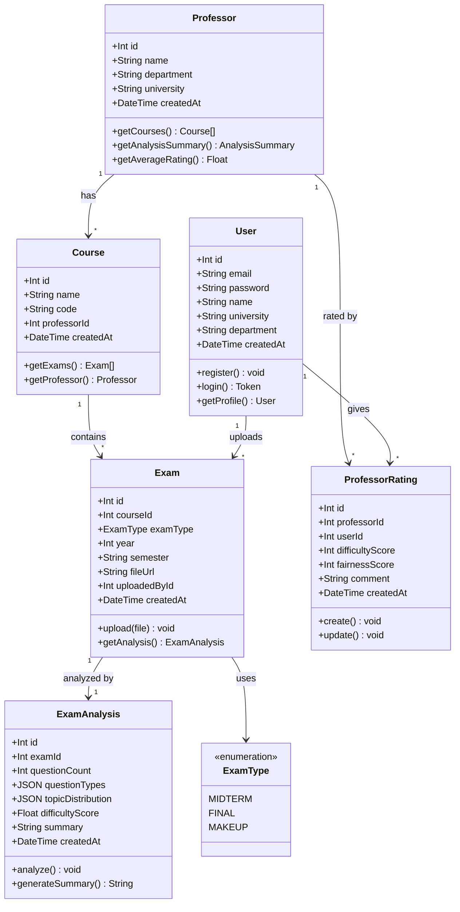
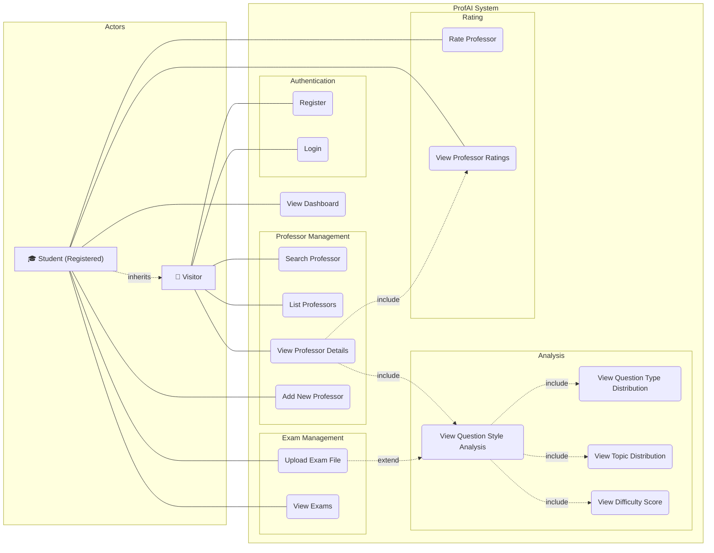
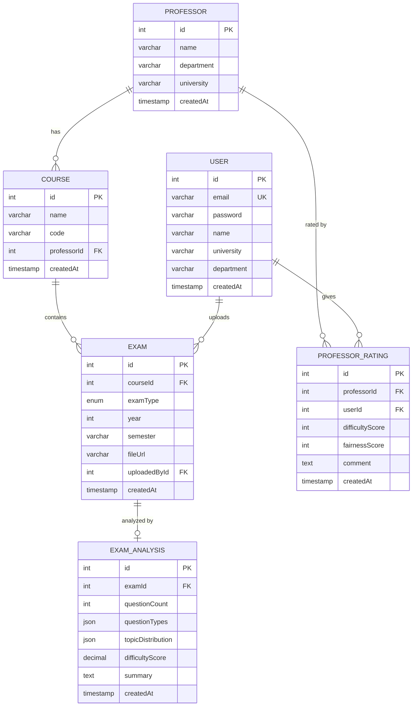

# ProfAI - Professor Exam Style Analysis Platform

<div align="center">

**A web application that analyzes professors' exam question styles using past exam papers.**

[](https://reactjs.org/)
[](https://nodejs.org/)
[](https://www.typescriptlang.org/)
[](https://www.postgresql.org/)
[](https://www.docker.com/)
[](https://www.prisma.io/)

</div>

---

## Table of Contents

- [About](#about)
- [Features](#features)
- [Tech Stack](#tech-stack)
- [Project Structure](#project-structure)
- [Database Schema](#database-schema)
- [UML Diagrams](#uml-diagrams)
- [API Endpoints](#api-endpoints)
- [Installation](#installation)
- [Team Members](#team-members)

---

## About

ProfAI is a web application that allows university students to upload past exam papers and analyze the professor's question style. The system extracts question patterns from uploaded exam data and answers the question: **"How does this professor ask questions?"**

Students can:
- Upload past exam files (PDF, JPG, PNG)
- View question type distribution (multiple choice, classic, true/false)
- See topic-based distribution analysis
- Check difficulty scores
- Rate professors on difficulty and fairness

---

## Features

| Feature | Description |
|---------|-------------|
| **Exam Upload** | Upload past exam files with course and exam type selection |
| **Question Style Analysis** | Automatic analysis of question types, topics, and difficulty |
| **Professor Profiles** | Detailed professor pages with analysis cards and ratings |
| **Interactive Charts** | Pie charts for question types, bar charts for topic distribution |
| **Rating System** | Rate professors on difficulty (1-5) and fairness (1-5) |
| **Search & Filter** | Search professors by name, filter by department and university |
| **Dashboard** | Personal dashboard showing uploads and contribution statistics |
| **Responsive Design** | Mobile-friendly design with Tailwind CSS |

---

## Tech Stack

| Layer | Technology | Purpose |
|-------|-----------|---------|
| Frontend | React.js + TypeScript | User interface |
| Styling | Tailwind CSS | Responsive design |
| Backend | Node.js + Express.js | REST API server |
| Database | PostgreSQL | Relational data storage |
| ORM | Prisma | Database management |
| File Upload | Multer | Exam file handling |
| Containerization | Docker + Docker Compose | Development environment |

---

## Project Structure

```
profai/
├── client/                 # React frontend
│   ├── src/
│   │   ├── components/     # Reusable UI components
│   │   ├── pages/          # Page components
│   │   ├── services/       # API service functions
│   │   ├── types/          # TypeScript type definitions
│   │   └── App.tsx         # Root component
│   ├── package.json
│   └── tailwind.config.js
├── server/                 # Node.js backend
│   ├── src/
│   │   ├── controllers/    # Route controllers
│   │   ├── routes/         # Express routes
│   │   ├── services/       # Business logic
│   │   ├── middleware/     # Auth & validation middleware
│   │   └── index.ts        # Server entry point
│   ├── prisma/
│   │   └── schema.prisma   # Database schema
│   └── package.json
├── docker-compose.yml      # Docker services configuration
├── .gitignore
└── README.md
```

---

## Database Schema

> See the full interactive ER diagram in the [UML Diagrams](#entity-relationship-diagram) section below.

---

## UML Diagrams

> Full editable diagrams are also available in [`ProfAI_UML_Diagrams.drawio`](./ProfAI_UML_Diagrams.drawio) — open with [app.diagrams.net](https://app.diagrams.net/)

### Class Diagram



### Use Case Diagram



### Entity Relationship Diagram



---

## API Endpoints

### Authentication
| Method | Endpoint | Description |
|--------|----------|-------------|
| POST | `/api/auth/register` | Register a new user |
| POST | `/api/auth/login` | Login and receive JWT token |

### Professors
| Method | Endpoint | Description |
|--------|----------|-------------|
| GET | `/api/professors` | List all professors |
| GET | `/api/professors/:id` | Get professor details |
| POST | `/api/professors` | Add a new professor |
| GET | `/api/professors/:id/analysis` | Get professor's question style analysis |

### Courses
| Method | Endpoint | Description |
|--------|----------|-------------|
| GET | `/api/courses` | List all courses |
| POST | `/api/courses` | Add a new course |
| GET | `/api/courses/:id` | Get course details |

### Exams
| Method | Endpoint | Description |
|--------|----------|-------------|
| POST | `/api/exams/upload` | Upload an exam file |
| GET | `/api/exams/course/:courseId` | List exams for a course |

### Ratings
| Method | Endpoint | Description |
|--------|----------|-------------|
| POST | `/api/ratings` | Rate a professor |
| GET | `/api/ratings/professor/:professorId` | Get professor's ratings |

---

## Installation

### Prerequisites

- [Docker](https://www.docker.com/get-started) & Docker Compose
- [Node.js](https://nodejs.org/) v20.x (for local development)

### Using Docker (Recommended)

```bash
# Clone the repository
git clone https://github.com/ProfAI-Team/ProfAI.git
cd ProfAI

# Start all services
docker-compose up -d

# Access the application
# Frontend: http://localhost:3000
# Backend:  http://localhost:5000
# Database: localhost:5432
```

### Local Development

```bash
# Clone the repository
git clone https://github.com/ProfAI-Team/ProfAI.git
cd ProfAI

# Backend setup
cd server
npm install
npx prisma migrate dev
npm run dev

# Frontend setup (in a new terminal)
cd client
npm install
npm run dev
```

---

## Team Members

| Name | Role | Responsibilities |
|------|------|-----------------|
| **Erdem Acar** | Full-Stack Developer | Auth, Professor/Course API, Dashboard page |
| **Enes Albas** | Full-Stack Developer | Exam upload, Analysis engine, Exam upload page |
| **Ali Emir Erten** | Full-Stack Developer | DB design, Docker, Rating system, Professor detail page |

---

## Project Documents

| Document | Description |
|----------|-------------|
| [`ProfAI_Project_Plan.xlsx`](./ProfAI_Project_Plan.xlsx) | Project plan with timeline, budget, risk & SWOT analysis |
| [`ProfAI_UML_Diagrams.drawio`](./ProfAI_UML_Diagrams.drawio) | Class Diagram and Use Case Diagram |
| [`JIRA_TASK_STRUCTURE.md`](./JIRA_TASK_STRUCTURE.md) | Jira board task structure with 30 tasks across 4 sprints |

---

## License

This project is developed as a university assignment for **UYG338 - Software Project Management** course.
